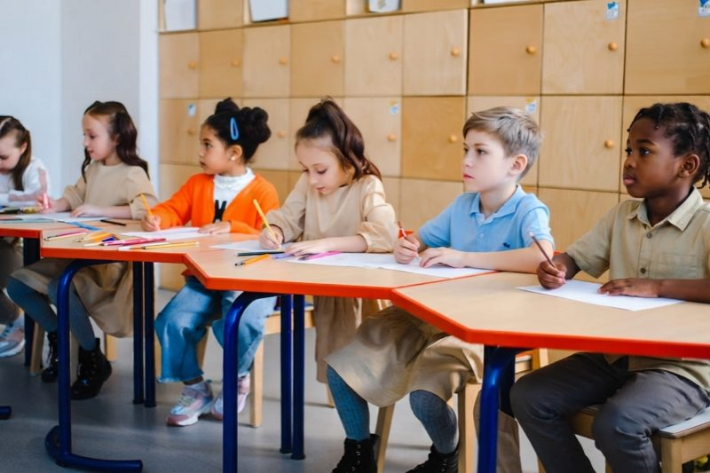

# PLAN — Creativista Learning static site

**Status: FROZEN.** Build exactly this. Do not add scope. Where this document and `reference/prototype.html` disagree, this document wins.

## Goal

Replace the current Canva Sites page at https://creativistalearning.org/ with a hand-built static site. The Canva export cannot emit heading elements, alt text, landmarks, `srcset`, `tel:` links, or reduced-motion rules; two of the five priority issues from the design critique are unfixable inside that tool. That is why we are rebuilding rather than editing.

`reference/prototype.html` is an **approved, verified design comp**. It renders correctly at 1440px and 390px. Preserve its visual design, layout, copy, color tokens, type scale, and motion. Your job is to turn one prototype file into a real, deployable, performant site — not to redesign it.

## Non-goals

- No redesign. No new sections, no reordering, no new color or type decisions.
- No framework. No React, no Astro, no Tailwind, no build step, no bundler, no npm dependencies.
- No CMS, no backend, no forms that post anywhere, no analytics, no cookie banner.
- No additional pages. This is one page.

## Stack

Plain HTML, CSS, and (only if genuinely needed) a few lines of vanilla JS. Deployable by dropping the folder on any static host.

## Target structure

```
index.html
css/styles.css
images/            # locally optimized, committed
  <name>-800.webp   <name>-800.jpg
  <name>-1600.webp  <name>-1600.jpg
favicon.svg
robots.txt
README.md
reference/prototype.html   # keep, do not ship
```

Move the prototype's `<style>` block into `css/styles.css` verbatim apart from the changes below. Keep the CSS custom properties, the 1.28 modular type scale, and the `--z-*` scale exactly as they are.

## Work items

### 1. Images (this is the largest item)

The prototype hotlinks the Pexels CDN. Ship local files instead.

Five source photos, Pexels IDs. Download the **original** from `https://images.pexels.com/photos/<ID>/pexels-photo-<ID>.jpeg`:

| ID | Subject | Suggested filename |
|---|---|---|
| 8923156 | Three children around one table in a bright classroom | `pod-table` |
| 8923075 | Tutor leaning in beside a girl, letters worksheet | `tutor-one-to-one` |
| 7026052 | Three children at a studio table, one holding up a drawing | `studio-table` |
| 8055126 | Father at the kitchen table with his daughter | `parent-kitchen` |
| 8612990 | Hands and coloured paper across a craft table | `craft-hands` |

Pexels license: free for commercial use, no attribution required. Do not add credit lines.

For each: produce WebP and JPEG at 800w and 1600w, quality ~78, stripped of EXIF. Use whatever is available locally (`cwebp`, `sharp-cli` via `npx`, `sips`, ImageMagick) — the tool does not matter, the output does. Keep total shipped image weight under 900 KB.

Replace each `` with `<picture>`:

```html
<picture>
  <source type="image/webp" srcset="images/pod-table-800.webp 800w, images/pod-table-1600.webp 1600w" sizes="...">
  
</picture>
```

- **Keep every `alt` string from the prototype exactly.** They were written deliberately.
- Set a real `sizes` per slot based on the CSS (hero circle, collage main, collage insets, cards, CTA band are all different widths).
- Hero image: `fetchpriority="high"`, no `loading` attribute. Every other image: `loading="lazy" decoding="async"`.
- Keep `width`/`height` on every `` so nothing shifts.

### 2. Contact details and identity

- Canonical brand name is **Creativista Learning**, everywhere, with no variants.
- Phone `954-833-6672` must be `tel:+19548336672` everywhere it appears.
- Email must be `mailto:`.
- ⚠️ The prototype uses `info@creativistalearning.org`. The live business currently uses `info@creativistacharm.com`. **Do not silently pick one.** Use `info@creativistalearning.org` and add a `TODO(owner)` HTML comment next to each occurrence noting the mailbox must exist before launch.
- Meta description must say ages 5 to 12 and "learning pods / tutoring". The current live site's description says "microschool, ages 2-10" and contradicts its own page. Do not carry that over.

### 3. Content placeholders

The prototype marks unknown content with `.ph` spans. Keep them visually obvious and add an HTML comment `<!-- TODO(owner): ... -->` at each. They are:

- Price for each of the three programs
- Teacher name and credential
- The "15+ years" claim (confirm before launch)
- Three parent testimonials with first name and child's age

Do not invent values. Do not delete the sections.

### 4. Booking link

Every "Book a free intro call" / "Book a free call" CTA points at one Square Appointments URL. It appears 6 times. Define it once at the top of `index.html` in a `<!-- BOOKING_URL: ... -->` comment and use the same literal everywhere, so a single find-and-replace updates it. Current placeholder: `https://squareup.com/appointments`. Add `rel="noopener"` and `target="_blank"` on external links.

### 5. Accessibility (non-negotiable, this is a P0 from the critique)

- Exactly one `<h1>`. `<h2>` per section, `<h3>` per card/feature. No skipped levels.
- `<header>`, `<nav aria-label="Main">`, `<main>`, `<footer>` landmarks.
- Every image has meaningful `alt`; every decorative SVG has `aria-hidden="true"`.
- Both social links need `aria-label` (already in the prototype — keep).
- Add a visible-on-focus skip link to `#main` as the first focusable element. The `.sr` class already exists.
- Visible focus ring on every interactive element (`:focus-visible` rule exists — verify it is not clipped by `overflow` anywhere).
- Verify contrast ≥4.5:1 for body text and ≥3:1 for large text. Pay attention to: amber button text on amber, the `.card--feature` body copy on amber, `.util` bar text on deep teal, and `.close` band body copy on teal. Report any pair that fails with its measured ratio; fix by darkening the ink, not by lightening the brand color.
- Reduced motion: the prototype gates all motion behind `@media (prefers-reduced-motion: no-preference)` and the `.reveal` default is `opacity:1`. **Preserve that inversion exactly.** Content must be fully visible with animations disabled and in a headless renderer.

### 6. Head and metadata

Add: `<html lang="en">` (present), canonical link, Open Graph and Twitter card tags (title, description, one 1200×630 image derived from `pod-table`), a `favicon.svg` using the teal disc and amber graduation-cap mark from the header, `theme-color`, and JSON-LD `LocalBusiness` structured data with name, phone, `areaServed: Plantation, FL`, and opening hours Mon–Fri 09:00–16:00. Do not put price in the JSON-LD while price is still a placeholder.

`robots.txt`: allow all, point at no sitemap (single page).

### 7. Fonts

The prototype loads Gabarito and Schibsted Grotesk from Google Fonts. Keep both families. Self-host them (woff2, latin subset only) under `css/fonts/`, with `font-display: swap` and a `preload` for the two weights used above the fold. This removes a third-party render-blocking request. If self-hosting proves messy, keeping the Google Fonts link is acceptable — say which you did and why.

## Verification (required before you report done)

Run these and paste the actual output:

1. `npx -y http-server . -p 8080` (or any static server) and load the page.
2. Screenshot at **1440×900** and **390×844**. Confirm: no horizontal scrollbar at either width, the hero highlight does not overflow its column, all eight images render, the header lock-up does not collide with the CTA at 390px.
3. Confirm with JS in the page: `document.querySelectorAll('h1').length === 1`, zero images with a null/empty `alt` (excluding decorative), and every `.reveal` element computes to `opacity: 1`.
4. Total page weight and request count, images included.
5. Confirm no request goes to `images.pexels.com`, `creativistalearning.org`, or (if you self-hosted fonts) `fonts.googleapis.com`.

State plainly anything you could not verify.

## Definition of done

- Page renders identically to `reference/prototype.html` at both widths, with local images.
- One `h1`, full landmark set, alt text everywhere, skip link, visible focus.
- `tel:` and `mailto:` live.
- Pricing, teacher, and testimonial placeholders present and marked `TODO(owner)`.
- No framework, no build step, no npm runtime dependency.
- `README.md` explains: how to preview locally, where to change the booking URL, where to fill the placeholders, and how to deploy (drag folder to Netlify / `vercel deploy`).

## Out of scope — do not do these

- Do not commit. Leave changes in the working tree for review.
- Do not deploy.
- Do not write the owner's real prices, teacher name, or testimonials.
- Do not add a contact form, newsletter signup, chat widget, or analytics.
